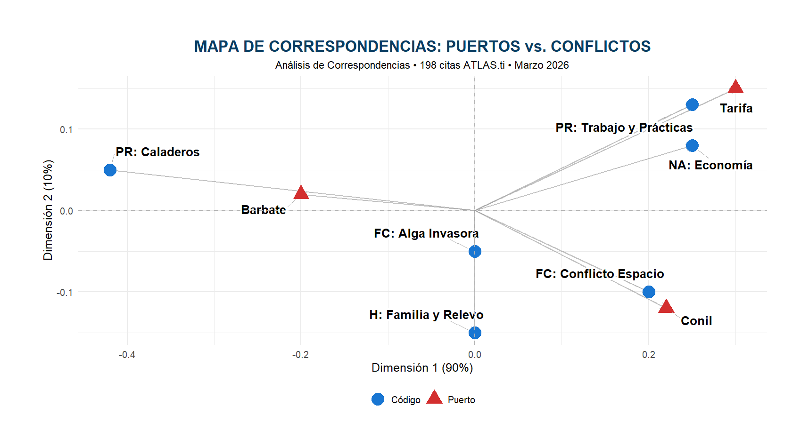

# 🌿 Invasive Algae Impact — Strait of Gibraltar

> Mixed-methods analysis of socio-environmental conflict in three fishing communities  
> **Barbate · Conil · Tarifa** · March 2026

---

## 📌 What is this project?

This project diagnoses the socio-environmental impact of the invasive algae *Rugulopteryx okamurae* on artisanal fishing communities in the Strait of Gibraltar.

Using **198 qualitative citations** extracted from ethnographic interviews, the analysis combines qualitative coding (ATLAS.ti) with data visualisation in R to identify conflict patterns, territorial intensity and socio-economic relationships across three ports.

---

## 🛠️ Methods & Tools

| Tool | Use |
|------|-----|
| **ATLAS.ti 24** | Ethnographic coding, co-occurrence analysis, concept networks |
| **R / RStudio** | Data visualisation (ggplot2, sankeyD3, factoextra) |
| **Mixed methods** | Qualitative + quantitative integration |

---

## 📊 Visualisations

### Conflict Intensity by Port — Heatmap

### Impact Flow — Sankey Diagram

### Conflict Interconnection Network

### Correspondence Map — Ports vs. Conflicts

### Critical Flows — Barbate, Conil and Tarifa

---

## 🔍 Main Findings

- **Barbate** is the most critically affected port — conflict mentions for fishing grounds (20) and invasive algae (19) indicate near-total collapse of usable sea space
- **Conil and Tarifa** show a more distributed conflict profile, with greater concern for economy and generational succession
- The strongest link in the system connects **algae → fishing grounds** (weight >20), confirming the environmental crisis as the primary economic driver
- The correspondence analysis reveals a **clear territorial fracture**: no uniform solution can be applied across the three ports

---

## 📁 Repository Structure
├── figures/        # R and ATLAS.ti visualisations
├── report/         # Full report (PDF)
└── README.md

---

## 👤 Author

**Antonio Fuentes Moreno**  
Anthropology Graduate · Social Data Analyst  
MSc Social Data Science — University of Granada  
📍 Seville, Spain  
[LinkedIn]https://www.linkedin.com/in/antonio-fuentes-moreno-9a08341a5/
